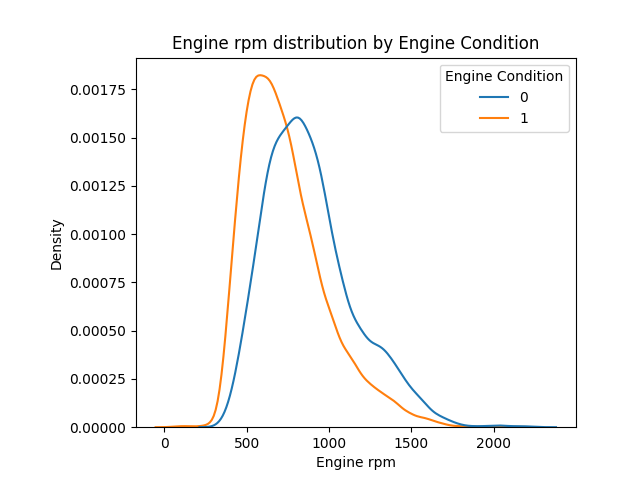
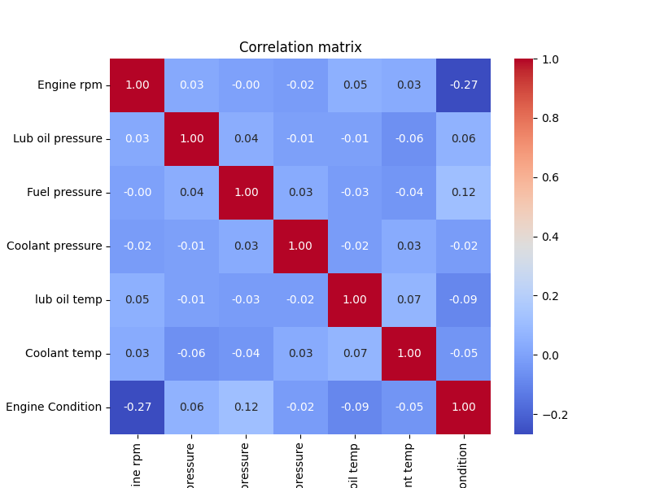
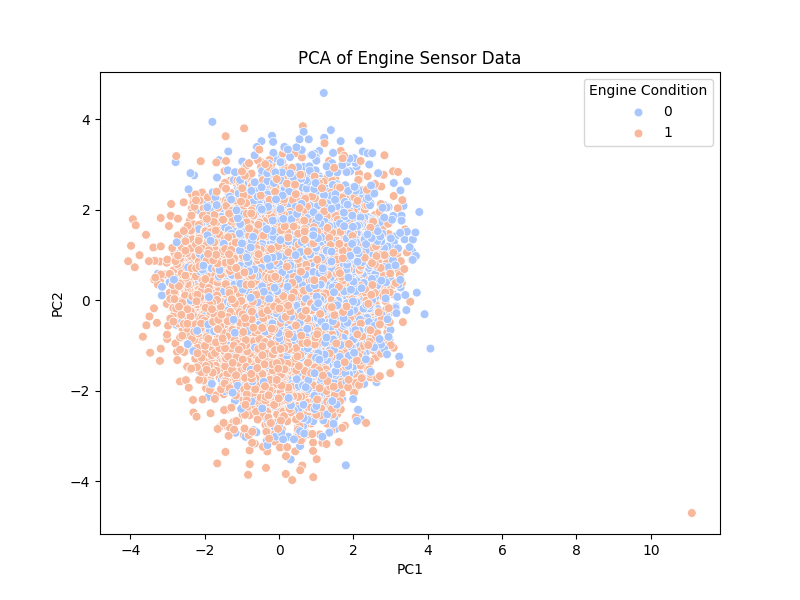
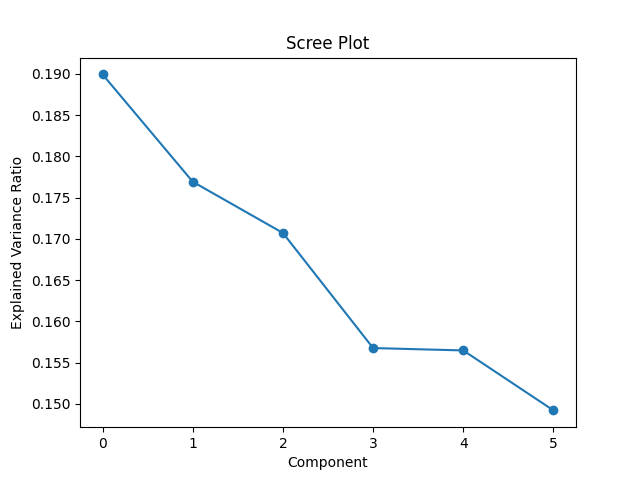

# Engine Health Prediction & Analysis
---
Rebecca Li | UCLA MASDS
This project builds a predictive maintenance framework for automotive engines using a Kaggle engine-sensor dataset. The goal is to analyze engine health, understand sensor behavior, and develop machine learning models that predict faulty engine states.


## 1. Project Overview

Modern engines generate rich real-time sensor data (temperature, pressure, RPM, etc.).  
This project explores:

- How sensors jointly describe engine behavior  
- Whether faulty engines have identifiable patterns  
- Whether unsupervised learning can separate healthy vs faulty engines  
- Which supervised models perform best for predictive maintenance  

## 2. Data Overview 

**Source:** [Kaggle — Automotive Vehicles Engine Health Dataset  ](https://www.kaggle.com/datasets/parvmodi/automotive-vehicles-engine-health-dataset/data)
Contains:
- Engine RPM  
- Lubricant oil pressure  
- Fuel pressure  
- Coolant pressure  
- Lubricant oil temperature  
- Coolant temperature  
- Engine condition (target variable: 0 = healthy, 1 = fault)

No missing values or duplicates → minimal data cleaning required.

```python
df["Engine Condition"].value_counts(normalize=True) 
```
The dataset is imbalanced. 
```text
Engine Condition
1    0.630509
0    0.369491
Name: proportion, dtype: float64
```

## 3. EDA 

```python
#Distribution by engine condition
target = "Engine Condition"
features = ["Engine rpm", "Lub oil pressure", "Fuel pressure",
            "Coolant pressure", "lub oil temp", "Coolant temp"]

for col in features:
    plt.figure()
    sns.kdeplot(data=df, x=col, hue=target, common_norm=False)
    plt.title(f"{col} distribution by Engine Condition")
    plt.show()
```

Engine rpm shows a slightly different pattern, which needs attention in the future. 


The correlation matrix further proved our assumption above. 

## 4. Unsupervised Learning

### **4.1 PCA**
```python
from sklearn.decomposition import PCA

features = ["Engine rpm", "Lub oil pressure", "Fuel pressure", 
            "Coolant pressure", "lub oil temp", "Coolant temp"]
Z = df[features]
scaler = StandardScaler()
Z_scaled = scaler.fit_transform(Z)

pca = PCA(n_components=3)
Z_pca = pca.fit_transform(Z_scaled)

print("Explained variance ratio:", pca.explained_variance_ratio_)

df['PC1'] = Z_pca[:,0]
df['PC2'] = Z_pca[:,1]
df['PC3'] = Z_pca[:,2]
```
First 3 components explain ~53% of variance.  

```text
Explained variance ratio: [0.1899485  0.17692968 0.17071361]
```


Variance is evenly distributed → sensors capture different dimensions of engine behavior.  
```python
pca_full = PCA().fit(Z_scaled)

plt.plot(pca_full.explained_variance_ratio_, marker='o')
plt.xlabel("Component")
plt.ylabel("Explained Variance Ratio")
plt.title("Scree Plot")
plt.show()
```

PCA scatter plots show no separation between faulty vs healthy engines.  

Confirms that dimensionality reduction is not beneficial.

### **4.2 Clustering (K-Means)**
Silhouette scores for k = 2–8 range only **0.12–0.16**  
→ far below the threshold (~0.25) for meaningful cluster structure.

**Conclusion:**  
The data does *not* naturally cluster.  
Engine faults result from **complex nonlinear interactions**, not geometric groups.


## 5. Supervised Models

### **5.1 Logistic Regression (Baseline)**
- Simple, linear baseline.
- Useful for quick benchmarking.

### **5.2 Random Forest**
- Captures nonlinear interactions.  
- Highest feature importances:  
  - Coolant Temp  
  - Lube Oil Temp  
  - Fuel Pressure  
  - Coolant Pressure  

RPM shows low importance → speed alone does not predict faults.

### **5.3 Gradient Boosted Decision Trees (GBDT)**
- Stronger nonlinear modeling than RF  
- Good balance of speed and accuracy

### **5.4 XGBoost**
- Best performing model overall  
- Handles imbalanced data and nonlinear boundaries well  
- Suitable for sensor-based predictive maintenance 


## 6. Model Calibration

- Ensures predicted probabilities reflect real fault likelihood.  
- Important for maintenance scheduling & risk thresholds.


## 7. Interpretation & Business Insights

- Engine faults are driven by **thermal & pressure signals**, not RPM.  
- The model shows that **multi-sensor interactions** matter more than single variables.  
- Fault risk increases when oil/coolant temperatures and pressures deviate from normal ranges.  
- Unsupervised learning is ineffective → faults do not form separate clusters.  
- XGBoost is the most reliable model for operational deployment.

**Applications:**
- Early warning of engine failures  
- Prioritized maintenance scheduling  
- Real-time fault detection for fleet operators  

---

## 8. Deliverables

- Jupyter Notebook / Python script  
- Fully reproducible Machine Learning pipeline  
- Visualizations: EDA, PCA, clustering metrics, feature importance  
- Slides for presentation (optional)

---

## 9. Future Work 

- Carlibration on xgb
- Add SHAP for xgb
- Build dashboard

